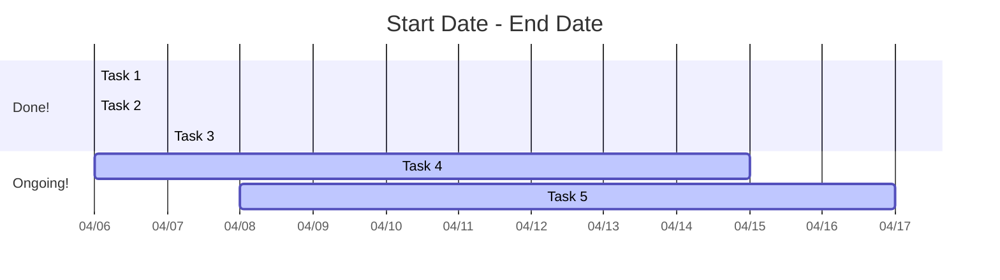

# :newspaper: _It's a Small World_ 
_Tales from the BrainWeb Volume-1_
Written by: *[Sofie Van Den Bossche](https://twitter.com/sofie_vdbos)* and *[Austin Benn](https://twitter.com/neurabenn)*

## :memo: BrainWeb Stats and Updates

 The BrainWeb kickoff was a roaring success with over 100 live viewers and 10 open source <a href ="https://brain-web.github.io/projects/">projects</a>. From there on out, the project pool has more than doubled<!-- ... -->. After only 2 months, the BrainWeb has already welcomed X members representing a diverse group of neuroscientists, both technically and geographically.

<!--The BrainWeb currently has X members after only 2 months and represents a diverse group of neuroscientists both technically, and geographically.--> 

<!-- After only 2 months, the BrainWeb has already welcomed X members, representing a diverse group of neuroscientists both technically and geographically. -->

## :memo: Node Reports: <a href="https://brainspace-brainweb.readthedocs.io/en/latest/">BrainSpace</a>

> Contact Information
>**Project Lead:** [Reinder Vos de Wael](https://twitter.com/reindervosdwael?lang=en)
>BrainSpace  

### :brain: All about BrainSpace
<!-- 
 -->
Macroscale Cortical gradients have taken the functional neuroimaging community by storm, but until recently implementing them into an exisitng analysis workflow has required a tailor made approach. Thanks to the recent development of [Brainspace](https://www.nature.com/articles/s42003-020-0794-7), there is now a software package available in both Matlab and Python which eases the technical aspects and provides statistical significance testing of Macroscale cortical Gradients in surface and volume space.
<!-- 
 -->

### :brain: BrainSpace & The BrainWeb
<!-- 
 -->
During and since the the BrainWeb kickoff meeting the BrainSpace team has worked on adding volumetric gradient visualization to the toolbox. Working simultaneously in both MATLAB and Python, they constructed a MATLAB viewer that projects gradients to 3D volume space and visualizes it over an anatomical image. Using the breadth of packages available in the Python eco-system, they further added metadata storage and interactive HTML output to the Python viewer.
<!-- ""
 -->

### :crystal_ball: Future Work for BrainSpace
* Create a Volume Viewer, that includes
    * Volume Scrolling
    * ColorMap Customization
    * Transparency Adjustments
    * Volume Rotations

<!-- ### :spiral_calendar_pad: Project Duration

-->
<!-- 
### :raised_hand: Project Team

 -->

